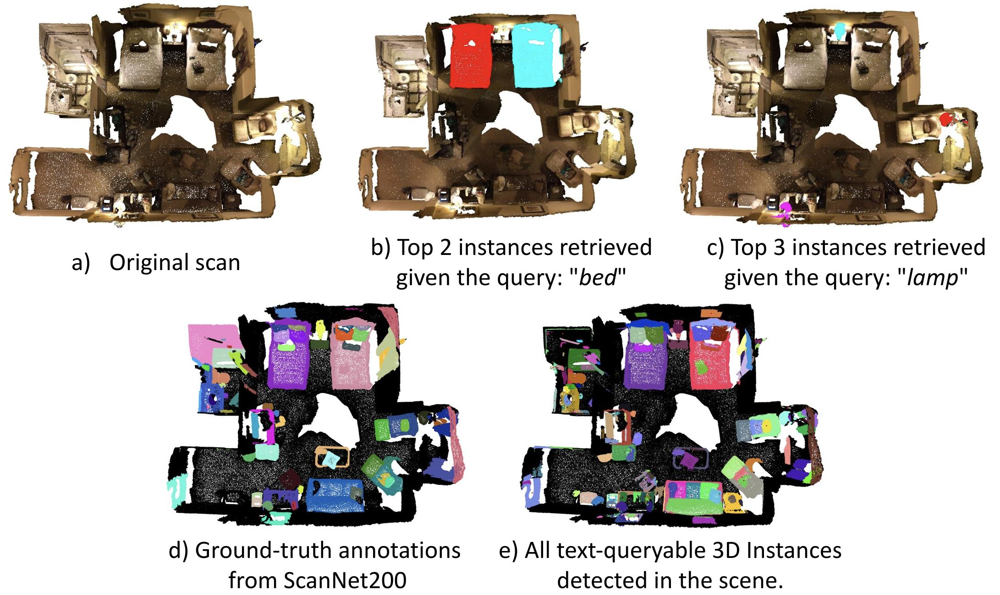
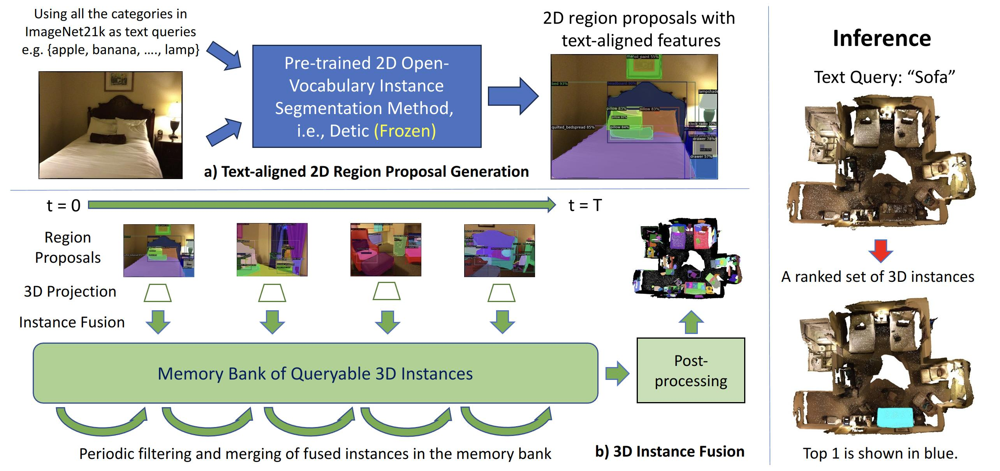
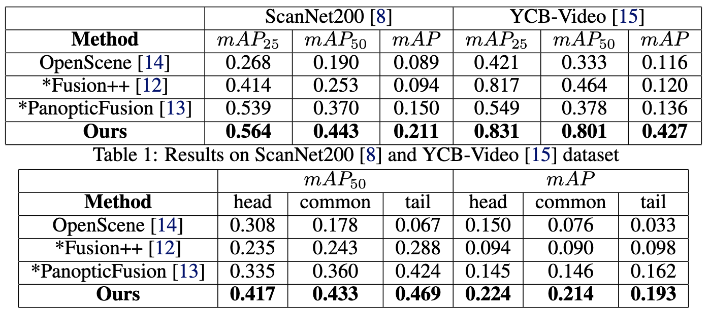

# OVIR-3D: Open-Vocabulary 3D Instance Retrieval Without Training on 3D Data

This work is still under review. Thus, we only release part of the paper content.

## Abstraction

This work presents a straightforward yet effective new method for open-vocabulary 3D object instance retrieval without using any 3D data for training. Given a language query, the proposed method is able to return a ranked set of 3D object instance segments based on the feature similarity of the instance and the text query. This is achieved by a multi-view fusion of text-aligned 2D region proposals into 3D space, where the 2D region proposal network could leverage 2D datasets, which are more accessible and typically larger than 3D datasets. The proposed fusion process is lightweight and efficient as it can be performed in real-time for most indoor 3D scenes and it does not require additional training in 3D space. Experiments on both an indoor room dataset (ScanNet200) and a tabletop dataset (YCB-video) show the effectiveness of the proposed method and its great potential for applications in robot navigation and manipulation.

## Introduction

There is recent progress in open-vocabulary 2D detection and segmentation methods~\cite{ViLD, Detic, OVSeg}, typically based on vision-language models~\cite{CLIP, ALIGN, florence} that are pre-trained on large data sets. In principle, this progress enables robots to detect and segment a wide variety of objects from 2D images. Open-vocabulary methods can detect and localize objects given an arbitrary text specification based on feature similarity. This is in contrast to traditional methods that can perform inference only over a closed set of categories, which are often the same as in the training set. The open-vocabulary aspect of such detectors has great benefits for robotics applications and reduces the need for retraining a model when novel categories are introduced to the robot's environment. For example, detecting not only a mug but also its handle is important for grasping the mug from its handle. Furthermore, open-vocabulary methods allow users to query an object not only by its category but also by its properties or affordance, such as "entertainment" and "graspable".

> Examples of open-vocabulary 3D instance retrieval using the proposed system.(a-c) Given a 3D scan reconstructed from an RGB-D video (e.g., scene0645 from ScanNet) and a text query (e.g., bed, lamp), the proposed method retrieves a set of 3D instances ranked based on their semantic similarity to the text query. (d-e) Instances that are not even in the ground-truth annotations can also be detected and queried by the proposed method, such as the cushions on the sofa.

Despite the success of the 2D open-vocabulary models, their counterparts in the 3D space have not yet been widely explored. 3D models are important for many robotic tasks, such as navigation and manipulation and autonomous robots need to reason regarding 3D object instances in their surroundings. One possible reason is the lack of large 3D datasets with sufficient object diversity for training open-vocabulary models. The 3D dataset with the largest number of object categories to date is ScanNet200~\cite{scannet200}, which contains 200 categories of objects. This, however, is 100x smaller than the 2D image dataset ImageNet21K~\cite{imagenet} in terms of object categories. The annotation cost in the 3D space is also significantly larger than in 2D, which makes it unlikely for 3D datasets to match the size of 2D datasets. Early efforts of dense semantic mapping~\cite{semanticfusion, maskfusion, fusion++, panopticfusion} address this problem by projecting multi-view 2D detections to 3D using a closed-set detector, which cannot handle arbitrary language queries. More recently, OpenScene~\cite{openscene} achieved open-vocabulary 3D semantic segmentation by projecting text-aligned pixel features extracted from a 2D open-vocabulary segmentation model to 3D and further distilling 3D features from the projected 2D features. Once point features are ensembled, a heatmap of the point cloud can be generated based on the feature similarity between points and the input text query. Nevertheless, manual thresholding is required during test time to generate a binary mask, which would be needed for robot manipulation or navigation purposes. OpenScene also lacks the ability to separate instances that belong to the same category, which also limits its use in robotics applications.

This work aims to address open-vocabulary 3D instance retrieval as shown in Figure~\ref{fig:overview}, i.e., given a text query during inference, return a set of 3D instance segments ranked by their semantic similarities to the  query. The 2 main contributions are: (1) an efficient 2D-to-3D instance fusion module given text-aligned region proposals, and (2) an open-vocabulary 3D instance retrieval method that, given a text query, returns a ranked set of 3D instances based on semantic similarity.

In particular, this work considers a scenario, where a mobile robot navigates in an indoor scene and automatically reconstructs the 3D environment using its RGB-D sensor and an off-the-shelf SLAM module. The method fuses semantic instance information to a reconstructed 3D scene, so that given a text query such as ``fetch a mug from the kitchen", the robot can locate the relevant object instances in the reconstructed 3D scene and perform the task. Similar to the aforementioned 2D open-vocabulary methods, the proposed method also leverages the power of 2D models trained on large image datasets. It first generates text-aligned 2D object region proposals by querying a 2D open-vocabulary detector with a very large vocabulary. Those region proposals and corresponding features are then fed to a data association method for 3D instance fusion that is based on the overlap of projected 3D segments and the similarity of their semantic features. Periodic filtering and merging of 3D instances is performed to remove noisy detections and to improve the quality of instance masks. Finally, a post-processing step separates objects that are not connected in the 3D space but are incorrectly associated. No additional training on any 3D data is required during this process, which makes it a plug-and-play tool for real robotic applications. During inference, the fused instances in 3D are ranked based on their semantic similarity to the input text query, and users can further specify if the most relevant instance or the top $k$ instances are to be retrieved depending on the specified task.

Extensive experiments and ablation studies were conducted on real scans of rooms from ScanNet~\cite{scannet200} and reconstructed tabletop scenes from the YCB-Video~\cite{posecnn} dataset to show the effectiveness of the proposed system and its components. Furthermore, real robot manipulation experiments highlight the benefits of instance segmentation compared to existing semantic segmentation methods. 

## Method

The overall pipeline of the proposed method is illustrated in figure~\ref{fig:pipeline}. To summarize, given a video frame, the method first generates 2D region proposals $\mathcal{R}^{2D} = \{r_1, .., r_k\}$ with text-aligned features $F^{2D} = \{f^{2D}_1, .., f^{2D}_k\}$ using an off-the-shelf 2D open-vocabulary method trained on large 2D datasets. The 2D region proposals $\mathcal{R}^{2D}$ of each frame $\mathcal{I}_t$ are then projected to the reconstructed 3D point cloud given the camera intrinsics $C$ and poses $P_t$. The projected 3D regions $\mathcal{R}^{3D}$ are either matched to existing 3D object instances $O = \{o_1, .., o_b\}$ with 3D features $F^{3D} = \{f^{3D}_1, .., f^{3D}_b\}$ stored in the memory bank $\mathcal{B}$, or added as a new instance if not matched with anything. The 2D region to 3D instance matching is based on feature similarity $s_{ij} = cos(f^{2D}_i, f^{3D}_j)$ and region overlapping $IoU(r^{3D}_i, o_j)$ in the 3D space. Matched regions are integrated into the 3D instance. To remove less reliable detections and improve segmentation quality, periodic filtering and merging of 3D instances in the memory bank $\mathcal{B}$ is performed every $T$ frames. A final post-processing step removes 3D instances that are too small and separates object instances that are not connected in 3D space but are incorrectly merged. During inference time, the text query $q$ will be used to match with a set of representative features of each 3D instance, and the instances $O$ will be ranked based on the  similarity and returned. Details of the proposed method are presented below.

> Pipeline of the proposed method.

he overall pipeline of the proposed method is illustrated in figure~\ref{fig:pipeline}. To summarize, given a video frame, the method first generates 2D region proposals $\mathcal{R}^{2D} = \{r_1, .., r_k\}$ with text-aligned features $F^{2D} = \{f^{2D}_1, .., f^{2D}_k\}$ using an off-the-shelf 2D open-vocabulary method trained on large 2D datasets. The 2D region proposals $\mathcal{R}^{2D}$ of each frame $\mathcal{I}_t$ are then projected to the reconstructed 3D point cloud given the camera intrinsics $C$ and poses $P_t$. The projected 3D regions $\mathcal{R}^{3D}$ are either matched to existing 3D object instances $O = \{o_1, .., o_b\}$ with 3D features $F^{3D} = \{f^{3D}_1, .., f^{3D}_b\}$ stored in the memory bank $\mathcal{B}$, or added as a new instance if not matched with anything. The 2D region to 3D instance matching is based on feature similarity $s_{ij} = cos(f^{2D}_i, f^{3D}_j)$ and region overlapping $IoU(r^{3D}_i, o_j)$ in the 3D space. Matched regions are integrated into the 3D instance. To remove less reliable detections and improve segmentation quality, periodic filtering and merging of 3D instances in the memory bank $\mathcal{B}$ is performed every $T$ frames. A final post-processing step removes 3D instances that are too small and separates object instances that are not connected in 3D space but are incorrectly merged. During inference time, the text query $q$ will be used to match with a set of representative features of each 3D instance, and the instances $O$ will be ranked based on the  similarity and returned. Details of the proposed method are presented below.

## Experiment

### Dataset

The first dataset used for the experiment is ScanNet200~\cite{scannet200}, which contains a validation set of 312 indoor scans with 200 categories of objects. Uncountable categories "floor", "wall", and "ceiling" and their subcategories are not evaluated. The second dataset is YCB-Video~\cite{posecnn}, which contains a validation set of 12 videos. It's a tabletop dataset that was originally designed for object 6DoF pose estimation for robot manipulation. The 3D scans of the tabletop scene are reconstructed by KinectFusion~\cite{kinectfusion}, and the 3D labels are generated given the mesh models and annotated poses of target objects. Hyper-parameters presented in the method section~\ref{sec:method} are the same for both datasets.

### Metrics

Standard mean average precision ($mAP$) metric for instance retrieval at different IoU thresholds is adopted for the evaluation purpose. In particular, $mAP_{25}$ and $mAP_{50}$ at the IoU threshold $\theta = 0.25$ and $\theta = 0.5$ respectively, as well as the overall $mAP$, which is the averaged $mAP$ at different IoU thresholds $\theta = [0.5:0.05:0.95]$ are reported. The proposed method can often find more instances than those annotated in a 3D scene. but only annotated object categories in a 3D scene are used as text queries for evaluation. The results were computed for each 3D scene and then averaged for the whole dataset.

### Baselines

The most relevant work to date is OpenScene~\cite{openscene}, which can search for objects given a text query. It returns a heatmap of the input point cloud based on the similarity between point features and the query feature. To use it as a baseline, a threshold needs to be set to convert the heatmap into a binary mask and then cluster foreground points into 3D instances using DBSCAN, similar to the post-processing step in section~\ref{sec:post_processing}. A set of thresholds uniformly sampled from 0.5 to 0.9 with a step of 0.03 is tested for each category and the one with the best overall performance is reported for OpenScene. Furthermore, a series of prior research has focused on semantic mapping using closed-vocabulary detectors. Among them, two representative works that don't use closed-set category labels for data association are Fusion++~\cite{fusion++} and PanopticFusion~\cite{panopticfusion}. Instead of using their whole SLAM system, this work assumes the ground truth 3D reconstruction and camera poses are given, and only tested their data association and instance mapping algorithms as baselines. Their backbone detector MaskRCNN~\cite{maskrcnn} is replaced with Detic~\cite{Detic} for open-vocabulary detection, and the mean feature of associated 2D detections for each instance is used to match text queries. 

### Results

Quantitative results on ScanNet200 and YCB-Video dataset are shown in Table~\ref{table:main_result}. Furthermore, results on different sets of categories with different frequencies in ScanNet200 are shown in Table~\ref{table:scannet_map}. The proposed method outperforms all other baselines by a large margin in terms of instance retrieval $mAP$. It also performs well on tail categories that do not frequently appear in the 3D dataset thanks to the use of 2D region proposals. It's surprising that OpenScene is not performing well on this task even with an automatically tuned threshold for each category. This is probably due to the fused features not being distinguishable enough to generate good boundaries of object instances.

> Results on ScanNet200 and YCB-Video.

## Conclusion

This paper presents OVIR-3D, a rather straightforward but effective method for open-vocabulary 3D instance retrieval. By utilizing an off-the-shelf open-vocabulary 2D instance segmentation method for region proposal and fusing its output 2D regions and text-aligned features in 3D space, the proposed method can achieve much better performance than other baselines without using any 3D instance annotation, additional training, or manual heatmap thresholding during inference. This method can also be used for 3D instance pseudo-label generation for self-supervised learning.

A limitation of the proposed method is that it misses very small objects, typically those with less than 50 points, as they are likely to be treated as noise and filtered out during fusion. Furthermore, while the proposed method can improve  segmentation quality due to multi-view noisy filtering, it still relies on the 2D segments and features to be accurate enough, since it does not use any 3D data for fine-tuning. A promising direction is to integrate this method with a 3D learning-based method to utilize the scarcer but clean 3D annotations.